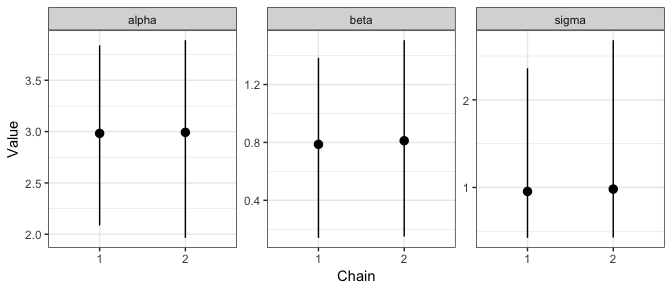

<!-- README.md is generated from README.Rmd. Please edit that file -->
    ## Loading required package: broom

dsmcmc
======

[](https://ci.appveyor.com/project/njtierney/dsmcmc) [](https://travis-ci.org/njtierney/dsmcmc) [](https://codecov.io/github/njtierney/dsmcmc?branch=master)

**License:** [MIT](https://opensource.org/licenses/MIT)

dsmcmc provides custom functions written in data.table for tidying up mcmc.list objects.

At this stage there are just two functions, `mcmc_to_dt` and `tidy.mcmc.list` - called with `tidy`.

`mcmc_to_dt` takes an `mcmc.list` object and turns it into a `data.table` of the format:

``` r
library(coda)
data(line)

head(data.frame(line$line1))
#>     alpha      beta     sigma
#> 1 7.17313 -1.566200 11.233100
#> 2 2.95253  1.503370  4.886490
#> 3 3.66989  0.628157  1.397340
#> 4 3.31522  1.182720  0.662879
#> 5 3.70544  0.490437  1.362130
#> 6 3.57910  0.206970  1.043500

library(dsmcmc)
mcmc_to_dt(line)
#>       iteration chain parameter    value
#>    1:         1     1     alpha 7.173130
#>    2:         2     1     alpha 2.952530
#>    3:         3     1     alpha 3.669890
#>    4:         4     1     alpha 3.315220
#>    5:         5     1     alpha 3.705440
#>   ---                                   
#> 1196:       196     2     sigma 1.306930
#> 1197:       197     2     sigma 0.846828
#> 1198:       198     2     sigma 0.465129
#> 1199:       199     2     sigma 0.672417
#> 1200:       200     2     sigma 0.639787
```

`tidy.mcmc.list` takes an `mcmc.list`, turns it into a `data.table` and summarises it in terms of each parameter's mean, median, standard deviation and credible interval with level given by `conf.level`:

``` r
tidy(line)
#>    parameter      mean        sd      2.5%    median    97.5%
#> 1:     alpha 2.9875644 0.4983950 1.9650403 3.0188300 3.876589
#> 2:      beta 0.7991864 0.3366834 0.1430713 0.7962500 1.469723
#> 3:     sigma 0.9680519 0.7413014 0.4249618 0.7911975 2.559520
```

We can also optionally ask for a subset of the parameters with a vector of `colnames` and summarise for each chain:

``` r
tidy(line, 
     chain = TRUE, 
     colnames=c("alpha"))
#>    parameter chain     mean        sd     2.5%   median    97.5%
#> 1:     alpha     1 2.982615 0.5313900 2.085719 2.973115 3.838839
#> 2:     alpha     2 2.992514 0.4643476 1.965040 3.063630 3.890256
```

This may be useful if we want to make a plot that shows how a given parameter varies from chain to chain

``` r
library(ggplot2)

line_tidy <- tidy(line, chain = TRUE)

ggplot(data = line_tidy, 
       aes(x = factor(chain), 
           y = mean)) +
    geom_pointrange(aes(ymin = `2.5%`,
                        ymax = `97.5%`)) +
    facet_wrap(~parameter, 
               nrow = 1, 
               scales = "free_y") +
    theme_bw() +
    xlab("Chain") +
    ylab("Value")
```



Installation
============

Install from github using:

``` r
# install.packages("devtools")
devtools::install_github("njtierney/dsmcmc")
```

Why dsmcmc?
===========

Full credit does to [Sam Clifford](https://samclifford.info/) for the name.

To lift directly from [wikipedia](https://en.wikipedia.org/wiki/Dal_Segno):

> In music, D.S. al coda instructs the musician to go back to the sign, and when Al coda or To coda is reached jump to the coda symbol.

This package works with `coda.samples`, where it tidies the data, for each chain. This repetitive action of cleaning and repeating for each chain is where the inspiration from the name comes from.

Additionally, it has several backronyms:

-   data science mcmc
-   descriptive statistics mcmc

and so on.

Future work
===========

-   Create summaries for each parameter
-   Perform diagnostic summaries for convergence
-   provide a suite of plotting in plotly, for speed, and interactivity.

### Code of Conduct

Please note that this project is released with a [Contributor Code of Conduct](CONDUCT.md). By participating in this project you agree to abide by its terms.
