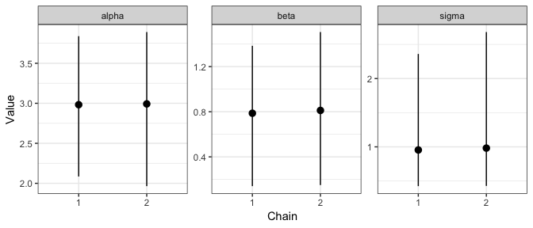

<!-- README.md is generated from README.Rmd. Please edit that file -->

# mmcc

<!-- badges: start -->

[](https://github.com/njtierney/mmcc/actions)
[](https://codecov.io/gh/njtierney/mmcc?branch=master)
<!-- badges: end -->

Tidying up MCMC output can be a real pain. There are plenty of packages
that help with summarising MCMC and providing their own summaries, but
sometimes *you just want a tidy data structure* so you can do your own
thing. And quickly.

`mmcc` provides tidying functions that return tidy data structure from
mcmc.list objects. It uses `data.table` as the backend for speediness,
it also provides `broom` tidiers to assist in some quick summaries.

# Installation

Install from github using:

``` r
# install.packages("remotes")
remotes::install_github("njtierney/mmcc")
```

# Using mmcc

`mcmc_to_dt` takes an `mcmc.list` object and turns it into a
`data.table` of the format:

``` r
library(coda)
data(line)

head(data.frame(line$line1))
#>     alpha      beta     sigma
#> 1 7.17313 -1.566200 11.233100
#> 2 2.95253  1.503370  4.886490
#> 3 3.66989  0.628157  1.397340
#> 4 3.31522  1.182720  0.662879
#> 5 3.70544  0.490437  1.362130
#> 6 3.57910  0.206970  1.043500
library(mmcc)

mcmc_dt <- mcmc_to_dt(line)

mcmc_dt
#>       iteration chain parameter    value
#>    1:         1     1     alpha 7.173130
#>    2:         2     1     alpha 2.952530
#>    3:         3     1     alpha 3.669890
#>    4:         4     1     alpha 3.315220
#>    5:         5     1     alpha 3.705440
#>   ---                                   
#> 1196:       196     2     sigma 1.306930
#> 1197:       197     2     sigma 0.846828
#> 1198:       198     2     sigma 0.465129
#> 1199:       199     2     sigma 0.672417
#> 1200:       200     2     sigma 0.639787
```

`tidy.mcmc.list` takes an `mcmc.list`, turns it into a `data.table` and
summarises it in terms of each parameter’s mean, median, standard
deviation and credible interval with level given by `conf.level`:

``` r
tidy(line)
#>    parameter      mean        sd      2.5%    median    97.5%
#> 1:     alpha 2.9875644 0.4983950 1.9650403 3.0188300 3.876589
#> 2:      beta 0.7991864 0.3366834 0.1430713 0.7962500 1.469723
#> 3:     sigma 0.9680519 0.7413014 0.4249618 0.7911975 2.559520
```

We can also optionally ask for a subset of the parameters with a vector
of `colnames` and summarise for each chain:

``` r
tidy(line, 
     chain = TRUE, 
     colnames=c("alpha"))
#>    parameter chain     mean        sd     2.5%   median    97.5%
#> 1:     alpha     1 2.982615 0.5313900 2.085719 2.973115 3.838839
#> 2:     alpha     2 2.992514 0.4643476 1.965040 3.063630 3.890256
```

This may be useful if we want to make a plot that shows how a given
parameter varies from chain to chain.

``` r
library(ggplot2)

line_tidy <- tidy(line, chain = TRUE)

ggplot(data = line_tidy, 
       aes(x = factor(chain), 
           y = mean)) +
    geom_pointrange(aes(ymin = `2.5%`,
                        ymax = `97.5%`)) +
    facet_wrap(~parameter, 
               nrow = 1, 
               scales = "free_y") +
    theme_bw() +
    xlab("Chain") +
    ylab("Value")
```

<!-- -->

# Helpers

`mmcc` provides helpers to extract the number of chains, iterations,
simulations, and variables in an MCMC object:

``` r
n_chain(line)
#> [1] 2
n_iter(line)
#> [1] 200
n_sims(line)
#> [1] 400
n_var(line)
#> [1] 3
```

# glance helper

General model summary providing information on:

-   Number of chains
-   Number of iterations
-   Number of variables/parameters
-   Lower and upper effective sample size (ESS)
-   lower and upper estimates of rhat measurement of convergence
    assessment

``` r
glance(line)
#>   n_chains n_iter n_var ess_lower ess_upper rhat_lower rhat_upper
#> 1        2    200     3  167.5889  455.3178   1.000695   1.037599
```

# Diagnostics

``` r
diag_autocorr(line)
diag_ess(line)
#>    chain parameter       ess
#> 1:     1     alpha 200.00000
#> 2:     1      beta 249.43130
#> 3:     1     sigma  90.16969
#> 4:     2     alpha 255.31778
#> 5:     2      beta 200.00000
#> 6:     2     sigma  77.41925
diag_mc_stderr(line)
#> Warning in bmeans(v$value, b_size, warn): likely too few samples (less than
#> 1000) for estimating Monte Carlo standard errors

#> Warning in bmeans(v$value, b_size, warn): likely too few samples (less than
#> 1000) for estimating Monte Carlo standard errors

#> Warning in bmeans(v$value, b_size, warn): likely too few samples (less than
#> 1000) for estimating Monte Carlo standard errors

#> Warning in bmeans(v$value, b_size, warn): likely too few samples (less than
#> 1000) for estimating Monte Carlo standard errors

#> Warning in bmeans(v$value, b_size, warn): likely too few samples (less than
#> 1000) for estimating Monte Carlo standard errors

#> Warning in bmeans(v$value, b_size, warn): likely too few samples (less than
#> 1000) for estimating Monte Carlo standard errors
#>    parameter chain      mean      value
#> 1:     alpha     1 2.9826146 0.03667355
#> 2:     alpha     2 2.9925142 0.03001358
#> 3:      beta     1 0.7866946 0.02285799
#> 4:      beta     2 0.8116781 0.02778074
#> 5:     sigma     1 0.9544249 0.10259971
#> 6:     sigma     2 0.9816789 0.04737521
```

# Thinning

``` r
thin_dt(mcmc_to_dt(line), thin = 10)
#>      iteration chain parameter    value
#>   1:         1     1     alpha 7.173130
#>   2:        11     1     alpha 3.065240
#>   3:        21     1     alpha 2.876460
#>   4:        31     1     alpha 2.943310
#>   5:        41     1     alpha 3.087570
#>  ---                                   
#> 116:       151     2     sigma 0.764629
#> 117:       161     2     sigma 1.315890
#> 118:       171     2     sigma 1.034110
#> 119:       181     2     sigma 2.362830
#> 120:       191     2     sigma 1.009290
```

# Why the name, “mmcc”?

Full credit does to [Sam Clifford](https://www.samclifford.info/) for
the name.

To quote Sam:

> …it’s all about reshaping and manipulating mcmc chains…therefore, mmcc

# Future work

-   Summaries for each parameter
-   More diagnostic summaries for convergence

### Code of Conduct

Please note that this project is released with a [Contributor Code of
Conduct](.github/CODE_OF_CONDUCT.md). By participating in this project
you agree to abide by its terms.
